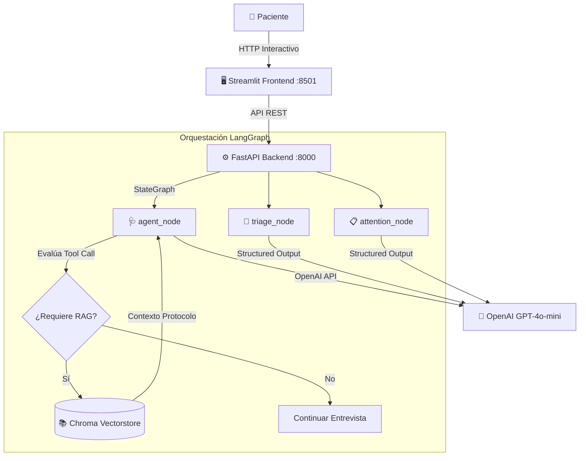

# 🚑 Emermédica AI Assistant

**Asistente Inteligente de Atención Médica, Toma de Síntomas y Clasificación de Triage**

Realizado por: **Juan Ricardo Albarracin Barbosa**

---

## 📌 Descripción del Proyecto

**Emermédica AI Assistant** es una plataforma orientada a la atención en salud que actúa como un **auxiliar de enfermería digital**. A través de una interacción conversacional empática y estructurada, el sistema guía al usuario durante la recolección de sus síntomas, consulta protocolos médicos oficiales mediante **RAG (Retrieval-Augmented Generation)**, clasifica el nivel de **Triage (I a IV)** y genera una síntesis médica estructurada con la sugerencia de especialidad para el personal de salud.

---

## 📌 Demo: [[Video](https://drive.google.com/file/d/1Avkh_7Wfx1BDvemQ9k_lCdKxnG0cfzZ2/view?usp=sharing)]

## ✨ Características Principales

- **Entrevista Clínica Guiada**: Recopila de forma secuencial el síntoma principal, signos de alarma, tiempo de inicio, intensidad (escala 1 a 10) y antecedentes.
- **🔍 RAG Médico Selectivo**: Invoca el protocolo clínico oficial en ChromaDB (`retrieve_medical_protocol`) únicamente cuando detecta síntomas principales, optimizando el consumo de tokens y el rendimiento.
- **🏥 Clasificación de Triage Automatizada**:
  - **Triage I**: Emergencia inmediata (riesgo vital inminente).
  - **Triage II**: Urgencia (potencial riesgo vital o signos de alarma).
  - **Triage III**: Prioritario (síntomas moderados sin riesgo vital).
  - **Triage IV**: No urgente (síntomas leves / crónicos estables).
- **📋 Generación de Atención Médica**: Resume el motivo de consulta, signos de alarma, tiempo de evolución y la **especialidad médica sugerida**.

---

## 🛠️ Tecnologías Utilizadas

- **Lenguaje**: Python 3.10+
- **Backend**: FastAPI
- **Frontend**: Streamlit
- **Orquestación de IA / Estado**: LangChain & LangGraph (`StateGraph`, `MemorySaver`)
- **Modelos de LLM**: OpenAI GPT-4o-mini
- **Vectorstore / RAG**: ChromaDB + OpenAI Embeddings
- **Contenedores**: Docker & Docker Compose

---

## 🏛️ Arquitectura del Sistema



---

## 📁 Estructura del Proyecto

```text
emermedica-ai-assistant/
├── backend/                    # API Backend (FastAPI)
│   ├── app/
│   │   ├── api/                # Rutas REST (/chat, /triage, /attention)
│   │   ├── assistant/          # Grafo LangGraph, prompts, nodos, herramientas
│   │   ├── core/               # Configuración y sistema de logging
│   │   ├── knowledge/          # Protocolos médicos en Markdown
│   │   ├── llm/                # Cliente OpenAI
│   │   ├── models/             # Esquemas Pydantic
│   │   ├── rag/                # Cargador e indexador ChromaDB
│   │   └── services/           # Servicios de negocio
│   ├── index_protocols.py      # Script de indexación vectorial RAG
│   └── main.py                 # Punto de entrada FastAPI
├── frontend/                   # Interfaz de Usuario (Streamlit)
│   ├── app.py                  # Aplicación Streamlit principal
│   └── services/               # Cliente HTTP hacia la API
├── docs/                       # Documentación Técnica
│   ├── architecture.md         # Diagramas y arquitectura detallada
│   ├── prompts.md              # Prompts del sistema y parsers
│   ├── setup_guide.md          # Guía de instalación y solución de problemas
│   └── postman_collection.json # Colección de solicitudes Postman
├── .env.example                # Plantilla de variables de entorno
├── docker-compose.yml          # Configuración para ejecución en contenedores
├── requirements.txt            # Dependencias Python
└── README.md                   # Documentación principal
```

---

## 🚀 Guía de Inicio Rápido

### 1. Variables de Entorno
Copia la plantilla `.env.example` a `.env` e ingresa tu API Key de OpenAI:

```bash
cp .env.example .env
```

Contenido del `.env`:
```env
PORT=8000
HOST=0.0.0.0
ENV=development
OPENAI_API_KEY=sk-proj-tu_api_key_aqui
MODEL=gpt-4o-mini
TEMPERATURE=0.2
```

---

### 2. Opción A: Ejecución con Docker (Recomendado)

```bash
# Levantar el Backend y Frontend simultáneamente
docker-compose up --build
```

- **Frontend**: [http://localhost:8501](http://localhost:8501)
- **Backend API**: [http://localhost:8000](http://localhost:8000)
- **Documentación Swagger**: [http://localhost:8000/docs](http://localhost:8000/docs)

---

### 3. Opción B: Ejecución Manual Local

```bash
# 1. Crear y activar entorno virtual
python -m venv venv

# En Windows:
.\venv\Scripts\Activate.ps1
# En Linux/Mac:
# source venv/bin/activate

# 2. Instalar dependencias
pip install -r requirements.txt

# 3. Indexar protocolos médicos en ChromaDB
python backend/index_protocols.py

# 4. Iniciar Backend (Servidor FastAPI en puerto 8000)
cd backend
python main.py

# 5. En otra consola, iniciar Frontend (Streamlit en puerto 8501)
cd frontend
streamlit run app.py
```

---

## 🧪 Pruebas Automáticas

Puedes verificar los componentes ejecutando los scripts de prueba en `backend/tests`:

```bash
# Probar búsqueda RAG en ChromaDB
python backend/test/test_rag.py

# Probar agente conversacional LangGraph
python backend/test/test_assistant.py

# Probar clasificación de Triage
python backend/test/test_triage.py
```

---

## 📚 Documentación Adicional

Para más detalles sobre la arquitectura, prompts y guías de extensión, consulta los archivos en la carpeta [`docs/`]
