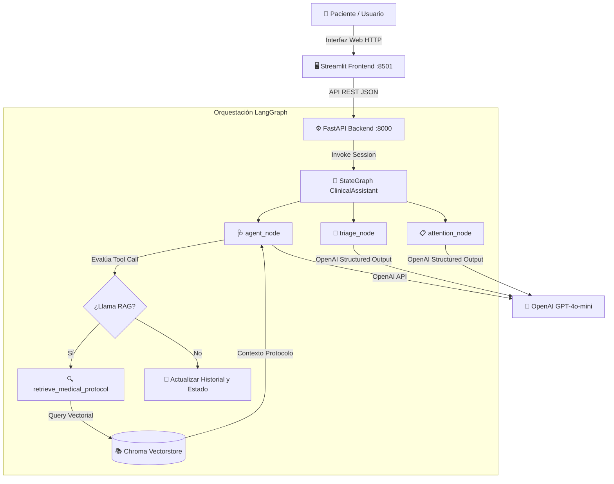
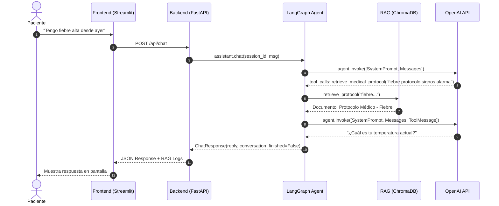

# Arquitectura de Emermédica AI Assistant

## 1. Visión General del Sistema

**Emermédica AI Assistant** es una plataforma basada en Inteligencia Artificial diseñada para actuar como un **auxiliar de enfermería digital**. Su propósito es orientar al paciente durante la recolección de síntomas clínicos, determinar la severidad y clasificación de **Triage (I a IV)** y estructurar un resumen médico junto con la sugerencia de especialidad para el equipo médico.

---

## 2. Componentes Principales

### 2.1 Frontend (Streamlit)
- **Ubicación**: `frontend/app.py`
- **Responsabilidad**:
  - Renderizar una interfaz interactiva de chat para la toma de síntomas.
  - Mostrar el historial de la conversación en tiempo real.
  - Renderizar los **Logs del RAG** (queries y protocolos consultados).
  - Presentar la **Consola del Sistema** (eventos de ejecución y llamadas a API).
  - Al finalizar la entrevista, ofrecer el botón para gatillar la generación de atención médica estructurada.

### 2.2 Backend API (FastAPI)
- **Ubicación**: `backend/app/`
- **Endpoints**:
  - `POST /api/chat`: Procesa cada turno de conversación entre el usuario y el asistente digital.
  - `POST /api/triage`: Clasifica el nivel de triage del paciente con base en la entrevista y guías clínicas.
  - `POST /api/attention`: Sintetiza la especialidad sugerida y el resumen clínico para el médico.

### 2.3 Orquestación con LangGraph (`ClinicalAssistant`)
- **Ubicación**: `backend/app/assistant/`
- **Estado Global (`ClinicalState`)**:
  - `messages`: Historial completo de mensajes (`HumanMessage`, `AIMessage`, `ToolMessage`).
  - `interview_completed`: Booleano que indica si la recolección de síntomas ha concluido.
  - `triage`, `prioridad`, `triage_justification`: Resultados de la clasificación de triage.
  - `especialidad_sugerida`, `resumen_clinico`: Síntesis de la atención médica.

- **Nodos del Grafo**:
  1. `agent_node`: Orquesta la entrevista clínica y evalúa si se debe invocar el RAG. Inyecta dinámicamente instrucciones de cierre al alcanzar el número máximo de preguntas (`MAX_QUESTIONS = 5`).
  2. `tools` (`ToolNode`): Ejecuta la búsqueda vectorial de protocolos en ChromaDB cuando el modelo lo solicita.
  3. `triage_node`: Evalúa la gravedad y asigna el Triage (I: Emergencia inminente, II: Urgente, III: Prioritario, IV: No urgente) alimentado por los protocolos RAG y el historial.
  4. `attention_node`: Genera la especialidad médica sugerida y un resumen estructurado para el profesional de salud.

---

## 3. Flujo RAG (Retrieval-Augmented Generation)

1. **Uso Selectivo**: El asistente sólo invoca `retrieve_medical_protocol` cuando el paciente menciona por primera vez un **síntoma clínico principal** (ej: *fiebre, dolor torácico, tos*).
2. **Optimización de Query**: La herramienta formulan un query clínico conciso (`"fiebre protocolo signos de alarma"`).
3. **Persistencia del Contexto**: Los fragmentos de protocolos recuperados se guardan como `ToolMessage` en la sesión y son consumidos posteriormente por los nodos de **Triage** y **Atención**.

