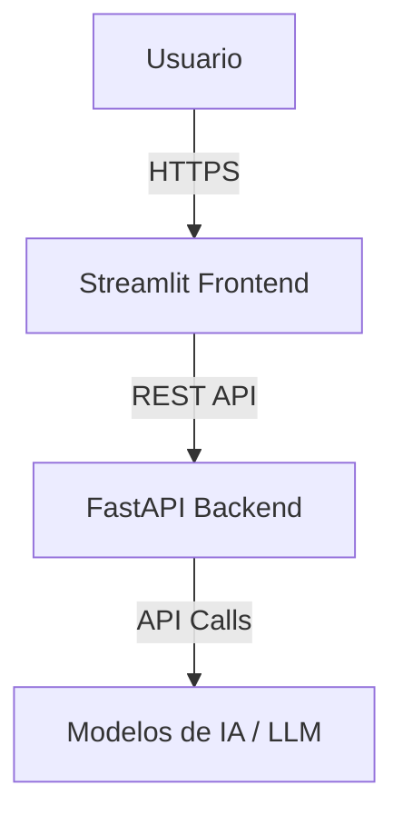

# Arquitectura de Emermédica AI

## Vista General

El sistema consta de los siguientes componentes principales:

1. **Frontend (Streamlit)**: Interfaz gráfica para interacción con el usuario final.
2. **Backend (FastAPI)**: API REST que maneja la lógica de negocio y comunicación con los modelos de IA.
3. **Servicios de IA / LLM**: Integración con APIs de inteligencia artificial.

